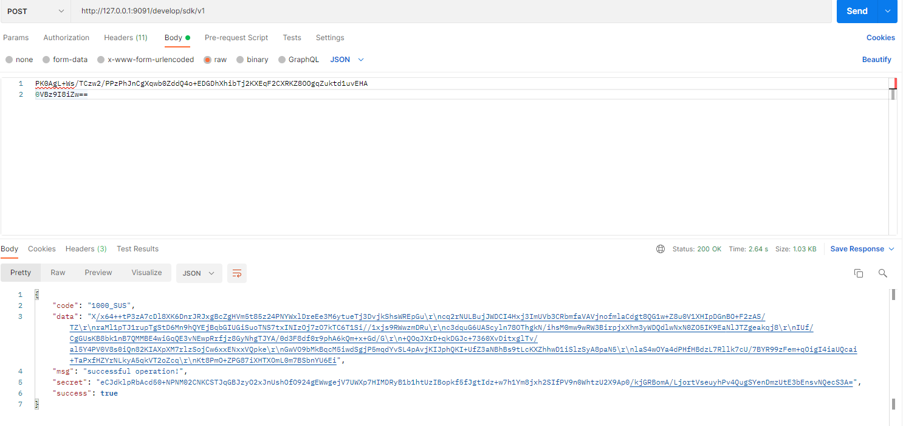
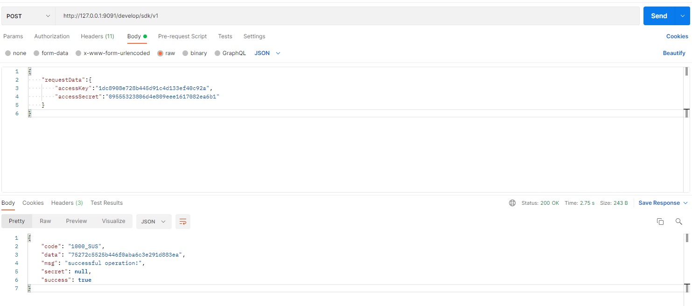

<div style="text-align: center; font-size: 36px; font-weight: bold">UStar SDK 接口文档</div>

<br/><br/>

# 0 修订记录

> 接口文档版本与UStar的版本号对应

| SDK版本 | 修改时间 | 修改人 | 修改内容                                                     |
| ------- | -------- | ------ | ------------------------------------------------------------ |
| 2.5.0   | 2021/10/20  | 井木   | 1.原java版本文档整理为通用版本<br />2. 添加人像返回人像ID<br />3.增加考勤报表接口相关<br />4. 接口优化 |
| 2.7.0   | 2022/01/25  | 井木   | 1. 增加 https 说明(#1.1) |

<br/><br/>

# 1 请求说明

## 1.1 请求地址

**统一路径: http://`127.0.0.1:9091`/develop/sdk/v1**

* `127.0.0.1:9091` 部分替换为UStar服务的ip和端口
* http 和 https 端口不一样
* 请求方法为`POST`
* 请求头：`Content-Type: application/json;charset=UTF-8`

| 字段名称         | 位置   | 类型   | 是否必须 | 说明                                                         |
| ---------------- | ------ | ------ | -------- | ------------------------------------------------------------ |
| sdkRequestKey  | header | String | Y        | 请求KEY                                                      |
| sdkAccessToken | header | String | Y        | 从服务端获取的token                                          |
| sdkSecretKey   | header | String | Y        | AES KEY经过[RSA publicKey](#2)加密后的密文                   |
| lang             | header | String | Y        | 语言种类，具体请看[字典3.1](#3.1)                            |
| requestData      | body   | String | Y        | requestData分为加密和不加密两种，具体请参考[requestData说明](#requestData) |

* `sdkAccessToken`: 有效期为1天，`UStar`重启后会失效

* `AES KEY`: AES KEY由开发者自己生成，每次请求key建议不同，生成规则参见

## 1.2 requestData说明<a id="requestData"></a>

### 1.2.1 加密接口

接口的参数作为json对象requestData的值，即

```json
   {
  "requestData": {
    "pageSize": 10,
    "empNo": "58693",
    "pageNum": 1
  }
}
```

再将上述json字符串进行AES加密后的密文作为请求body

 ```
 PK0AgL+Ws/TCzw2/PPzPhJnCgXqwb0ZddQ4o+EDGDhXhibTj2KXEqF2CXRKZ8OOgqZuktd1uvEHA
 0VBz9I8iZw==
 ```

Postman中request body 示例


### 1.2.2 不加密接口

不加密接口：直接将接口参数作为json对象requestData的值

```json
  {
    "requestData": {
      "accessKey": "1dc8908e728b445d91c4d133ef40c92a",
      "accessSecret": "09555323806d4e809eee1617082ea6b1"
    }
  }
```
上述json字符串作为请求body

Postman中request body 示例



# 2 密钥<a id="2"></a>

> 管理员在UStar开发者接入平台页面，创建一个新的开发者平台
> 系统会自动为该新平台生成` accessKey `和 `accessSecret`，还有数据加解密用的 `publicKey`
> 其中`accessKey`和`accessSecret`用于权限认证生成`sdkAccessToken`

## 2.1 RSA

RSA的公钥和私钥由UStar生成，再UStar的对接平台页面获取RSA公钥。公钥用来加解密AES key

## 2.2 AES

* AES key 由开发者自己生成，使用`128 bit` 即`16 byte`
* 偏移量`iv` 从`AES key`中获取，规则为：第一步将`AES key`反转（倒序）后取前`16`位

# 3 数据字典

> 各字典数据包括但不限于以下字典项

## 3.1 语言<a id ="3.1"></a>

| 字典项   | 字典值 | 值类型 | 说明         |
| -------- | ------ | ------ | ------------ |
| 中文     | zh_CN  | String | 简体中文     |
| 英文     | en     | String | English      |
| 法语     | fr     | String | Français     |
| 俄罗斯语 | ru     | String | русский язык |
| 西班牙语 | es     | String | Español      |

## 3.2 性别<a id ="3.2"></a>

| 字典项 | 字典值 | 值类型 | 说明                  |
| ------ | ------ | ------ | --------------------- |
| 未填写 | 0      | number | 未填写 java byte 类型 |
| 男     | 1      | number | 男 java byte 类型     |
| 女     | 2      | number | 女 java byte 类型     |

## 3.3 员工权限类型<a id="3.3"></a>

| 字典项   | 字典值 | 值类型 | 说明     |
| -------- | ------ | ------ | -------- |
| 人像识别 | 1      | number | 人像识别 |
| 刷卡识别 | 2      | number | 刷卡识别 |
| 人卡合一 | 3      | number | 人卡合一 |
| 人证比对 | 4      | number | 人证比对 |

## 3.4 事件类型

| 字典项       | 字典值 | 值类型 | 说明         |
| ------------ | ------ | ------ | ------------ |
| 识别记录事件 | 1      | number | 识别记录事件 |
| 员工添加事件 | 2      | number | 员工添加事件 |
| 员工更新事件 | 3      | number | 员工更新事件 |
| 员工删除事件 | 4      | number | 员工删除事件 |
| 部门添加事件 | 5      | number | 部门添加事件 |
| 部门更新事件 | 6      | number | 部门更新事件 |
| 部门删除事件 | 7      | number | 部门删除事件 |

## 3.5 考勤日期类型<a id="3.5"></a>

| 字典项             | 字典值 | 值类型 | 说明               |
| ------------------ | ------ | ------ | ------------------ |
| 工作日(普通时间段) | 1      | number | 工作日(普通时间段) |
| 工作日(弹性时间段) | 2      | number | 工作日(弹性时间段) |
| 休息日             | 3      | number | 休息日             |
| 节假日             | 4      | number | 节假日             |
| 未排班             | 5      | number | 未排班             |

## 3.6 设备状态<a id="3.6"></a>

| 字典项       | 字典值 | 值类型 | 说明         |
| ------------ | ------ | ------ | ------------ |
| 设备离线     | 0      | number | 设备离线     |
| 设备在线     | 1      | number | 设备在线     |
| 设备禁用     | 2      | number | 设备禁用     |
| 设备密码错误 | 3      | number | 设备密码错误 |

# 4 SDK接口

## 4.1 接口响应说明

> ResponseHeader中`Content-Type: application/json;charset=UTF-8`

### 4.1.1 统一结果返回字段<a id="4.1.1"></a>

| 字段名称 | 参数类型 | 说明                                             |
| :------- | :------- | :----------------------------------------------- |
| code     | String   | 返回参数的code，`1000_SUS`表示成功，其他表示失败 |
| success  | boolean  | `true`表示成功，`false`表示失败                  |
| msg      | String   | `successful operation!`  or `operation failed!`  |
| data     | Object   | 各请求返回的数据进行AES加密后的字符串            |
| secret   | String   | AES KEY进行RSA私钥加密后的密文(需使用公钥解密)   |

**注意：**

* **4.2中的接口如果无返回数据，实际接口的data字段则为null**
* **4.2中的接口如果字段名称为`无`，返回数据即为data字段的内容**

### 4.1.2 分页结果返回字段

> 以下字段作为公共响应字段中的data字段的数据

| 字段名称 | 参数类型        | 说明                                                         |
| -------- | --------------- | ------------------------------------------------------------ |
| pageNum  | number(integer) | 页码                                                         |
| pageSize | number(integer) | 分页数据数量                                                 |
| pages    | number(integer) | 总页数                                                       |
| total    | number(long)    | 总数据数量                                                   |
| list     | array(list)     | 数据集合 java list<br />分页查询的接口的数据实际为list的内容 |

## 4.2 测试接口

### 4.2.1 测试接口

* sdkRequestKey : `test`

* 请求参数说明：无请求参数

* 响应参数说明：

  | 字段名称 | 字段类型 | 说明                       |
      | -------- | -------- | -------------------------- |
  | 无       | String   | 你好，这里是离线客户端服务 |

## 4.3 鉴权API

### 4.3.1 获取sdkAccessToken

* sdkRequestKey : `authToken`

* 请求参数说明

  | 字段名称     | 字段类型 | 是否必须 | 说明                   |
      | ------------ | -------- | -------- | ---------------------- |
  | accessKey    | String   | Y        | 开发者接入平台页面获取 |
  | accessSecret | String   | Y        | 开发者接入平台页面获取 |

  > 该请求无需进行body加密，即
   ```json
   {
       "requestData":{
           "accessKey":"1dc8908e728b445dxxxxxxxxx",
           "accessSecret":"09555323806d4exxxxxxxxxxxxxx"
       }
   }
   ```
* 响应参数说明

  | 字段名称 | 字段类型 | 说明                                                         |
      | -------- | -------- | ------------------------------------------------------------ |
  | 无       | String   | 返回的字符串为请求其他接口的凭证，放在request header中sdkAccessToken项 |

  > **注意：token未进行加密，有效期为1天，`UStar`重启后 会失效**

## 4.4 人员相关API

### 4.4.1 添加人员

* sdkRequestKey : `addPerson`

* 请求参数说明

  | 字段名称     | 字段类型      | 是否必须 | 说明                                     |
      | ------------ | ------------- | -------- | ---------------------------------------- |
  | empNo        | String        | Y        | 人员编号，唯一值，仅字母和数字，长度为32 |
  | name         | String        | Y        | 开发者接入平台页面获取                   |
  | phone        | String        | N        | 手机号码                                 |
  | ~~workNo~~   | String        | N        | 工号,不建议使用，不校验，请使用empNo字段 |
  | mail         | String        | N        | 邮箱                                     |
  | stageName    | String        | N        | 花名                                     |
  | cardNo       | String        | N        | IC卡号                                   |
  | entryTime    | String        | N        | 入职时间 yyyy-MM-dd HH:mm:ss 格式        |
  | workPlace    | String        | N        | 工作地点                                 |
  | personTypeId | String        | N        | 员工类型ID                               |
  | tel          | String        | N        | 座机                                     |
  | gender       | number(byte)  | N        | 性别，字典[3.2](#3.2)                    |
  | idCardNo     | String        | N        | 身份证号码                               |
  | roleId       | String        | N        | 角色id                                   |
  | deptIdList   | array(string) | N        | 所属部门集合id  list                     |

* 响应参数说明

  | 字段名称 | 字段类型 | 说明                 |
      | -------- | -------- | -------------------- |
  | 无       | String   | 人员id，不是人员编号 |

### 4.4.2 更新人员

* sdkRequestKey : `updatePerson`

* 请求参数说明

  | 字段名称     | 字段类型      | 是否必须 | 说明                                     |
      | ------------ | ------------- | -------- | ---------------------------------------- |
  | empNo        | String        | Y        | 人员编号，唯一值，仅字母和数字，长度为32 |
  | name         | String        | Y        | 开发者接入平台页面获取                   |
  | phone        | String        | N        | 手机号码                                 |
  | ~~workNo~~   | String        | N        | 工号,不建议使用，不校验，请使用empNo字段 |
  | mail         | String        | N        | 邮箱                                     |
  | stageName    | String        | N        | 花名                                     |
  | cardNo       | String        | N        | IC卡号                                   |
  | entryTime    | String        | N        | 入职时间 yyyy-MM-dd HH:mm:ss 格式        |
  | workPlace    | String        | N        | 工作地点                                 |
  | personTypeId | String        | N        | 员工类型ID                               |
  | tel          | String        | N        | 座机                                     |
  | gender       | number(byte)  | N        | 性别，字典[3.2](#3.2)                    |
  | idCardNo     | String        | N        | 身份证号码                               |
  | roleId       | String        | N        | 角色id                                   |
  | deptIdList   | array(string) | N        | 所属部门集合id  list                     |

* 响应参数说明: 无

### 4.4.3 分页查询人员

* sdkRequestKey : `queryPersonPage`

* 请求参数说明

  | 字段名称   | 字段类型      | 是否必须 | 说明                 |
      | ---------- | ------------- | -------- | -------------------- |
  | empNo      | String        | Y        | 人员编号             |
  | name       | String        | Y        | 员工姓名，全词匹配   |
  | deptIdList | array(string) | N        | 所属部门集合id  list |

* 响应参数说明

  | 字段名称     | 字段类型      | 说明                                     |
      | ------------ | ------------- | ---------------------------------------- |
  | empId        | String        | 人员id                                   |
  | empNo        | String        | 人员编号，唯一值，仅字母和数字，长度为32 |
  | name         | String        | 开发者接入平台页面获取                   |
  | phone        | String        | 手机号码                                 |
  | ~~workNo~~   | String        | 工号,不建议使用，不校验，请使用empNo字段 |
  | orgId        | String        | 公司ID                                   |
  | mail         | String        | 邮箱                                     |
  | stageName    | String        | 花名                                     |
  | cardNo       | String        | IC卡号                                   |
  | entryTime    | String        | 入职时间 yyyy-MM-dd HH:mm:ss 格式        |
  | workPlace    | String        | 工作地点                                 |
  | personTypeId | String        | 员工类型ID                               |
  | tel          | String        | 座机                                     |
  | gender       | number(byte)  | 性别，字典[3.2](#3.2)                    |
  | idCardNo     | String        | 身份证号码                               |
  | roleId       | String        | 角色id                                   |
  | deptIdList   | array(string) | 所属部门集合id  list                     |

### 4.4.4 删除人员

* sdkRequestKey : `deletePerson`

* 请求参数说明

  | 字段名称 | 字段类型 | 是否必须 | 说明   |
    | -------- | -------- | -------- | ------ |
  | empId    | String   | Y        | 人员ID |

* 响应参数说明: 无

## 4.5 人像相关API

### 4.5.1 添加人员人像

* sdkRequestKey : `addPersonFace`

* 请求参数说明

  | 字段名称 | 字段类型 | 是否必须 | 说明         |
      | -------- | -------- | -------- | ------------ |
  | empNo    | String   | Y        | 人员编号     |
  | faceData | byte[]   | Y        | 图片byte数组 |

* 响应参数说明

  | 字段名称 | 字段类型 | 说明         |
    | -------- | -------- | ------------ |
  | 无       | String   | 添加的人像ID |

### 4.5.2 删除人员人像

* sdkRequestKey : `deletePersonFace`

* 请求参数说明

  | 字段名称 | 字段类型 | 是否必须 | 说明     |
      | -------- | -------- | -------- | -------- |
  | empNo    | String   | Y        | 人员编号 |
  | photoId  | String   | Y        | 人像id   |

* 响应参数说明：无

## 4.6 文件相关API

### 4.6.1 获取人像

* sdkRequestKey : `getPersonFace`

* 请求参数说明

  | 字段名称 | 字段类型 | 是否必须 | 说明   |
      | -------- | -------- | -------- | ------ |
  | faceId   | String   | Y        | 人像Id |

* 响应参数说明

  | 字段名称 | 字段类型 | 说明             |
      | -------- | -------- | ---------------- |
  | content  | byte[]   | 人像图片byte数组 |

### 4.6.2 获取图片

* sdkRequestKey : `getImage`

* 请求参数说明

  | 字段名称 | 字段类型 | 是否必须 | 说明   |
      | -------- | -------- | -------- | ------ |
  | imageId  | String   | Y        | 图片Id |

* 响应参数说明

  | 字段名称 | 字段类型 | 说明         |
      | -------- | -------- | ------------ |
  | content  | byte[]   | 图片byte数组 |

## 4.7 部门相关API

> group 此处实际为部门

### 4.7.1 添加部门

* sdkRequestKey : `addPersonGroup`

* 请求参数说明

  | 字段名称        | 字段类型     | 是否必须 | 说明                                                         |
      | --------------- | ------------ | -------- | ------------------------------------------------------------ |
  | personGroupName | String       | Y        | 部门名称                                                     |
  | parentGroupId   | String       | Y        | 父级部门id<br />为空时，将添加根部门<br />错误上级部门id时，将设置为根部门 |
  | managerNos      | String array | Y        | 管理员person NO 集合 String List                             |

* 响应参数说明

  | 字段名称 | 字段类型 | 说明   |
      | -------- | -------- | ------ |
  | 无       | String   | 部门ID |

### 4.7.2 更新部门

* sdkRequestKey : `updatePersonGroup`

* 请求参数说明

  | 字段名称        | 字段类型     | 是否必须 | 说明                                                         |
      | --------------- | ------------ | -------- | ------------------------------------------------------------ |
  | personGroupId   | String       | Y        | 部门id                                                       |
  | personGroupName | String       | Y        | 部门名称                                                     |
  | parentGroupId   | String       | N        | 父级部门id<br />为空时，将添加根部门<br />错误上级部门id时，将设置为根部门 |
  | managerNos      | String array | N        | 管理员person NO 集合 String List                             |

* 响应参数说明: 无

### 4.7.3 查询部门

* sdkRequestKey : `getPersonGroup`

* 请求参数说明

  | 字段名称      | 字段类型 | 是否必须 | 说明   |
      | ------------- | -------- | -------- | ------ |
  | personGroupId | String   | Y        | 部门id |

* 响应参数说明

  | 字段名称        | 字段类型     | 说明               |
      | --------------- | ------------ | ------------------ |
  | personGroupId   | String       | 部门ID             |
  | personGroupName | String       | 部门名称           |
  | parentGroupId   | String       | 父级部门id         |
  | managerNos      | String array | 管理员personNo集合 |

### 4.7.4 删除部门

* sdkRequestKey : `getPersonGroup`

* 请求参数说明

  | 字段名称      | 字段类型 | 是否必须 | 说明   |
      | ------------- | -------- | -------- | ------ |
  | personGroupId | String   | Y        | 部门id |

* 响应参数说明：无

## 4.8 角色相关API

> 此处角色实际意义为人员职称职级

### 4.8.1 添加角色

* sdkRequestKey : `addPersonRole`

* 请求参数说明

  | 字段名称 | 字段类型 | 是否必须 | 说明     |
      | -------- | -------- | -------- | -------- |
  | roleName | String   | Y        | 角色名称 |

* 响应参数说明

  | 字段名称 | 字段类型 | 说明   |
      | -------- | -------- | ------ |
  | 无       | String   | 角色ID |

### 4.8.2 更新角色

* sdkRequestKey : `updatePersonRole`

* 请求参数说明

  | 字段名称 | 字段类型 | 是否必须 | 说明     |
      | -------- | -------- | -------- | -------- |
  | roleId   | String   | Y        | 角色ID   |
  | roleName | String   | Y        | 角色名称 |

* 响应参数说明：无

### 4.8.3 删除角色

* sdkRequestKey : `deletePersonRole`

* 请求参数说明

  | 字段名称 | 字段类型 | 是否必须 | 说明   |
    | -------- | -------- | -------- | ------ |
  | roleId   | String   | Y        | 角色ID |

* 响应参数说明: 无

### 4.8.4 查询角色

* sdkRequestKey : `listAllPersonRoles`

* 请求参数说明

  | 字段名称 | 字段类型 | 是否必须 | 说明     |
      | -------- | -------- | -------- | -------- |
  | roleId   | String   | Y        | 角色ID   |
  | roleName | String   | Y        | 角色名称 |


* 响应参数说明

  | 字段名称 | 字段类型 | 说明     |
      | -------- | -------- | -------- |
  | roleId   | String   | 角色ID   |
  | roleName | String   | 角色名称 |

## 4.9 人员类型相关API

### 4.9.1 添加人员类型

* sdkRequestKey : `addPersonType`

* 请求参数说明

  | 字段名称 | 字段类型 | 是否必须 | 说明     |
      | -------- | -------- | -------- | -------- |
  | typeName | String   | Y        | 类型名称 |

* 响应参数说明

  | 字段名称 | 字段类型 | 说明   |
      | -------- | -------- | ------ |
  | 无       | String   | 类型ID |

### 4.9.2 删除人员类型

* sdkRequestKey : `deletePersonRole`

* 请求参数说明

  | 字段名称 | 字段类型 | 是否必须 | 说明   |
      | -------- | -------- | -------- | ------ |
  | typeId   | String   | Y        | 类型ID |

* 响应参数说明：无

### 4.9.3 更新人员类型

* sdkRequestKey : `updatePersonRole`

* 请求参数说明

  | 字段名称 | 字段类型 | 是否必须 | 说明     |
      | -------- | -------- | -------- | -------- |
  | typeId   | String   | Y        | 角色ID   |
  | typeName | String   | Y        | 角色名称 |

* 响应参数说明：无

### 4.9.4 查询人员类型

* sdkRequestKey : `listAllPersonTypes`

* 请求参数说明：无

* 响应参数说明

* | 字段名称 | 字段类型 | 说明         |
        | -------- | -------- | ------------ |
  | typeId   | String   | 人员类型id   |
  | typeName | String   | 人员类型名称 |

## 4.10 设备相关API

### 4.10.1 添加设备

* sdkRequestKey : `addDevice`

* 请求参数说明

  | 字段名称      | 字段类型 | 是否必须 | 说明                               |
    | ------------- | -------- | -------- | ---------------------------------- |
  | deviceName    | String   | Y        | 角色ID                             |
  | deviceIp      | String   | Y        | 角色名称                           |
  | devicePass    | String   | Y        | 设备密码                           |
  | deviceGroupId | String   | Y        | 设备分组ID                         |
  | lang          | String   | Y        | 设备语言（en（英文） zh-CN（中文） |


* 响应参数说明

  | 字段名称 | 字段类型 | 说明 |
    | -------- | -------- | ---- |
  | 无 | String | device Key 设备序列号 |

### 4.10.2 更新设备

* sdkRequestKey : `updateDevice`

* 请求参数说明

  | 字段名称      | 字段类型 | 是否必须 | 说明                                 |
      | ------------- | -------- | -------- | ------------------------------------ |
  | deviceName    | String   | Y        | 角色ID                               |
  | deviceIp      | String   | Y        | 角色名称                             |
  | devicePass    | String   | Y        | 设备密码                             |
  | deviceGroupId | String   | Y        | 设备分组ID                           |
  | lang          | String   | Y        | 设备语言（en（英文） zh-CN（中文）） |
  | deviceKey     | String   | Y        | 设备序列号                           |


* 响应参数说明：无

### 4.10.3 删除设备

* sdkRequestKey : `forceDeleteDevice`

* 请求参数说明

  | 字段名称  | 字段类型 | 是否必须 | 说明       |
      | --------- | -------- | -------- | ---------- |
  | deviceKey | String   | Y        | 设备序列号 |

* 响应参数说明：无

### 4.10.4 查询设备

* sdkRequestKey : `queryDevicePage`

* 请求参数说明

  | 字段名称         | 字段类型     | 是否必须 | 说明                                        |
    | ---------------- | ------------ | -------- | ------------------------------------------- |
  | pageNum          | Integer      | Y        | 页码                                        |
  | pageSize         | Integer      | Y        | 分页大小                                    |
  | deviceKey        | String       | N        | 设备序列号                                  |
  | deviceName       | String       | N        | 设备名称                                    |
  | deviceIp         | String       | N        | 设备ip                                      |
  | deviceGroupId    | String       | N        | 设备分组ID                                  |
  | status           | number       | N        | 设备状态<br />数据字典[3.6](#3.6)           |
  | cardSupport      | Boolean      | N        | 是否支持刷卡                                |
  | recognitionModes | number array | N        | byte list<br />识别模式 字典数据[3.3](#3.3) |

* 响应参数说明

  | 字段名称        | 字段类型     | 说明              |
      | --------------- | ------------ | ----------------- |
  | deviceKey       | String       | 设备序列号        |
  | deviceName      | String       | 设备名称          |
  | status          | number       | 设备状态,字典数据 |
  | enable          | Boolean      | 设备启用禁用状态  |
  | expType         | expType      | 设备异常类型      |
  | orgId           | String       | 设备团队id        |
  | softwareVersion | String       | 设备软件版本      |
  | sdkVersion      | String       | 设备算法版本      |
  | deviceIp        | String       | 设备ip地址        |
  | recognitionMode | number array | 设备识别模式      |
  | deviceGroupId   | String       | 设备所在分组id    |
  | deviceGroupName | String       | 设备所在分组名称  |
  | lang            | String       | 设备语言          |
  | faceNum         | Integer      | 设备人像数量      |
  | personNum       | Integer      | 设备人员数量      |
  | cardSupport     | Boolean      | 设备是否支持刷卡  |

### 4.11.5 查询单个设备

* sdkRequestKey : `getDevice`

* 请求参数说明

  | 字段名称  | 字段类型 | 是否必须 | 说明       |
      | --------- | -------- | -------- | ---------- |
  | deviceKey | String   | Y        | 设备序列号 |


* 响应参数说明

  | 字段名称        | 字段类型     | 说明              |
      | --------------- | ------------ | ----------------- |
  | deviceKey       | String       | 设备序列号        |
  | deviceName      | String       | 设备名称          |
  | status          | number       | 设备状态,字典数据 |
  | enable          | Boolean      | 设备启用禁用状态  |
  | expType         | expType      | 设备异常类型      |
  | orgId           | String       | 设备团队id        |
  | softwareVersion | String       | 设备软件版本      |
  | sdkVersion      | String       | 设备算法版本      |
  | deviceIp        | String       | 设备ip地址        |
  | recognitionMode | number array | 设备识别模式      |
  | deviceGroupId   | String       | 设备所在分组id    |
  | deviceGroupName | String       | 设备所在分组名称  |
  | lang            | String       | 设备语言          |
  | faceNum         | Integer      | 设备人像数量      |
  | personNum       | Integer      | 设备人员数量      |
  | cardSupport     | Boolean      | 设备是否支持刷卡  |

## 4.11 设备分组相关API

### 4.11.1 添加设备分组

* sdkRequestKey : `addDeviceGroup`

* 请求参数说明

  | 字段名称        | 字段类型     | 是否必须 | 说明       |
      | --------------- | ------------ | -------- | ---------- |
  | deviceGroupName | String       | Y        | 设备组名称 |
  | remark          | String       | N        | remark     |
  | deviceKeyList   | String array | N        | 设备序列号 |

* 响应参数说明

  | 字段名称 | 字段类型 | 说明       |
      | -------- | -------- | ---------- |
  | 无       | String   | 设备分组ID |

### 4.11.2 删除设备分组

* sdkRequestKey : `deleteDeviceGroup`

* 请求参数说明

  | 字段名称      | 字段类型 | 是否必须 | 说明     |
      | ------------- | -------- | -------- | -------- |
  | deviceGroupId | String   | Y        | 设备组ID |

* 响应参数说明: 无

### 4.11.3 更新设备分组

* sdkRequestKey : `updateDeviceGroup`

* 请求参数说明

  | 字段名称        | 字段类型     | 是否必须 | 说明       |
      | --------------- | ------------ | -------- | ---------- |
  | deviceGroupId   | String       | Y        | 设备组id   |
  | deviceGroupName | String       | Y        | 设备组名称 |
  | remark          | String       | N        | remark     |
  | deviceKeyList   | String array | N        | 设备序列号 |

* 响应参数说明：无

### 4.11.4 查询设备分组

* sdkRequestKey : `listAllDeviceGroup`

* 请求参数说明：无

* 响应参数说明

  | 字段名称        | 字段类型     | 说明            |
      | --------------- | ------------ | --------------- |
  | deviceGroupId   | String       | 设备分组ID      |
  | deviceGroupName | String       | 名称            |
  | remark          | Integer      | 备注            |
  | deviceNum       | String       | 设备数量        |
  | deviceKeyList   | String array | 设备序列号 列表 |

## 4.12 设备授权相关API

### 4.12.1 添加授权

* sdkRequestKey : `addDeviceAuth`

* 请求参数说明

  | 字段名称              | 字段类型     | 是否必须 | 说明                                                         |
    | --------------------- | ------------ | -------- | ------------------------------------------------------------ |
  | empNo                 | String       | Y        | 员工编号                                                     |
  | deviceKey             | String       | Y        | 设备序列号                                                   |
  | imgStoreDevice        | Boolean      | Y        | 是否存储原图                                                 |
  | permissionStartTime   | Date         | N        | 权限有效期开始时间 yyyy-MM-dd HH:mm:ss                       |
  | permissionEndTime     | Date         | N        | 权限有效期结束时间 yyyy-MM-dd HH:mm:ss                       |
  | permissionTimeEntries | array        | N        | 权限时间段（最多六段）                                       |
  | -- startTime          | String       | N        | 开始时间HH:mm                                                |
  | -- endTime            | String       | N        | 结束时间HH:mm                                                |
  | recognitionTypes      | number array | N        | 识别类型 1.人像识别;2.刷卡识别;3.人卡合一;4.人证对比 <br />参见字典[3.6](#3.3) |

* 响应参数说明：无

### 4.12.2 更新授权

* sdkRequestKey : `updateDeviceAuthRequest`

* 请求参数说明

  | 字段名称              | 字段类型     | 是否必须 | 说明                                   |
      | --------------------- | ------------ | -------- | -------------------------------------- |
  | empNo                 | String       | Y        | 员工编号                               |
  | deviceKey             | String       | Y        | 设备序列号                             |
  | imgStoreDevice        | Boolean      | Y        | 是否存储原图                           |
  | permissionStartTime   | Date         | N        | 权限有效期开始时间 yyyy-MM-dd HH:mm:ss |
  | permissionEndTime     | Date         | N        | 权限有效期结束时间 yyyy-MM-dd HH:mm:ss |
  | permissionTimeEntries | array        | N        | 权限时间段（最多六段）                 |
  | -- startTime          | String       | N        | 开始时间HH:mm                          |
  | -- endTime            | String       | N        | 结束时间HH:mm                          |
  | recognitionTypes      | number array | N        | 识别模式 字典数据[3.3](#3.3)           |

* 响应参数说明：无

### 4.12.3 删除授权

* sdkRequestKey : `deleteDeviceAuth`

* 请求参数说明

  | 字段名称  | 字段类型 | 是否必须 | 说明       |
      | --------- | -------- | -------- | ---------- |
  | empNo     | String   | Y        | 员工编号   |
  | deviceKey | String   | Y        | 设备序列号 |

* 响应参数说明：无

### 4.12.4 查询授权

* sdkRequestKey : `queryDeviceAuthPage`

* 请求参数说明

  | 字段名称      | 字段类型 | 是否必须 | 说明           |
      | ------------- | -------- | -------- | -------------- |
  | pageNum       | Integer  | Y        | 页码           |
  | pageSize      | Integer  | Y        | 分页大小       |
  | departmentId  | String   | N        | 部门id         |
  | empId         | String   | N        | 员工id         |
  | empNo         | String   | N        | 员工编号       |
  | empName       | String   | N        | 员工名称       |
  | empTypeId     | String   | N        | 员工类型id     |
  | cardNum       | String   | N        | 员工卡号       |
  | deviceKey     | String   | N        | 设备序列号     |
  | deviceName    | String   | N        | 设备名称       |
  | deviceGroupId | String   | N        | 设备分组名称id |

* 响应参数说明

  | 字段名称                 | 字段类型     | 说明                                                         |
      | ------------------------ | ------------ | ------------------------------------------------------------ |
  | empNo                    | String       | 员工编号                                                     |
  | deviceKey                | String       | 设备序列号                                                   |
  | recModeTypes             | number array | 员工权限类型                                                 |
  | faces                    | object array | 员工授权的人像 数组                                          |
  | -- faceId                | String       | 人像id                                                       |
  | -- photoId               | String       | 照片id                                                       |
  | -- status                | number       | 照片授权状态 <br />1：授权中 <br />2：授权完成 <br />3：授权失败<br />4：消权中 <br />5：消权成功 <br />6：消权失败 |
  | -- photoUrl              | String       | 照片路径                                                     |
  | -- failedReason          | String       | 失败原因                                                     |
  | permissionTime           | Object       | 人员时间权限                                                 |
  | -- permissionStartTime   | Date         | 权限起始时间 yyyy-MM-dd HH:mm:ss                             |
  | -- permissionEndTime     | Date         | 权限结束时间 yyyy-MM-dd HH:mm:ss                             |
  | -- permissionTimeEntries | Object       | 权限时间段设置 对象                                          |
  | -- -- startTime          | String       | 开始时间 HH:mm                                               |
  | -- -- endTime            | String       | 结束时间 HH:mm                                               |

## 4.13 设备搜索发现

### 4.13.1 开始搜索设备

* sdkRequestKey : `startSearchDevice`

* 请求参数说明：无

* 响应参数说明：无


### 4.13.2 设备搜索结果

* sdkRequestKey : `getDeviceSearchTask`

* 请求参数说明: 无

* 响应参数

  | 字段名称        | 字段类型 | 说明                 |
      | --------------- | -------- | -------------------- |
  | deviceKey       | String   | 设备序列号           |
  | deviceName      | String   | 设备名称             |
  | deviceGroupName | String   | 设备分组名称         |
  | softwareVersion | String   | 设备固件的软件版本号 |
  | ip              | String   | ip                   |
  | alreadyExist    | Boolean  | UStar上是否已存在    |
  | hasPassword     | Boolean  | 设备是否有密码       |
  | dhcp            | Boolean  | 设备网络是否dhcp     |


## 4.14 考勤报表相关API

### 4.14.1 考勤明细报表

* sdkRequestKey : `atdDetailReport`

* 请求参数说明

  | 字段名称  | 字段类型 | 是否必须 | 说明                |
      | --------- | -------- | -------- | ------------------- |
  | pageNum   | Integer  | Y        | 页码                |
  | pageSize  | Integer  | Y        | 每页限制条数        |
  | deptId    | String   | N        | 部门id              |
  | empName   | String   | N        | 员工名称/编号       |
  | startDate | date     | N        | 开始日期 yyyy-MM-dd |
  | endDate   | date     | N        | 结束日期 yyyy-MM-dd |

* 响应参数说明

  | 字段名称               | 字段类型     | 说明                                                 |
      | ---------------------- | ------------ | ---------------------------------------------------- |
  | personId               | String       | 人员id                                               |
  | personNo               | String       | 员工编号                                             |
  | name                   | String       | 人员姓名                                             |
  | depNames               | String array | 部门名称集合                                         |
  | roleNames              | String array | 职位名称集合                                         |
  | atDate                 | date         | 日期 yyyy-MM-dd                                      |
  | timeIntervalName       | String       | 时间段名称                                           |
  | planSignInDatetime     | Date         | 应签到时间 yyyy-MM-dd HH:mm:ss                       |
  | planSignOutDatetime    | Date         | 应签退时间 yyyy-MM-dd HH:mm:ss                       |
  | planTimeIntervalSecond | long number  | 时间段计划工作时长，单位秒                           |
  | realSignInTime         | Date         | 实际签到时间 yyyy-MM-dd HH:mm:ss                     |
  | signInStatus           | number       | 签到状态 1正常 2缺卡 3迟到 4早退 5未打卡(缺卡) 6加班 |
  | realSignOutTime        | date         | 实际签退时间 yyyy-MM-dd HH:mm:ss                     |
  | signOutStatus          | number       | 签退状态 1正常 2缺卡 3迟到 4早退 5未打卡(缺卡) 6加班 |
  | realWorkTimeSecond     | long number  | 实际工作时长 单位秒                                  |
  | normalWorkSecond       | long number  | 正常工作时长 单位秒                                  |
  | realLateSecond         | long number  | 迟到时长 单位秒                                      |
  | realLeaveEarlySecond   | long number  | 早退时长 单位秒                                      |
  | realAbsenteeismSecond  | long number  | 旷工时长 单位秒                                      |
  | workDayOverWorkSecond  | long number  | 工作日加班时长 单位秒                                |
  | restDayOverWorkSecond  | long number  | 休息日加班时长 单位秒                                |
  | holidayOverWorkSecond  | long number  | 节假日加班时长 单位秒                                |
  | dateType               | number       | 日期类型  字典数据[3.5](#3.5)                        |
  | signInStart            | Date         | 开始签到时间,当且仅当dateType=2时有值                |
  | signInEnd              | Date         | 结束签到时间,当且仅当dateType=2时有值                |

### 4.14.2 考勤明细报表

* sdkRequestKey : `atdOverWorkReport`

* 请求参数说明

  | 字段名称  | 字段类型 | 是否必须 | 说明                |
      | --------- | -------- | -------- | ------------------- |
  | pageNum   | Integer  | Y        | 页码                |
  | pageSize  | Integer  | Y        | 每页限制条数        |
  | deptId    | String   | N        | 部门id              |
  | empName   | String   | N        | 员工名称/编号       |
  | startDate | date     | N        | 开始日期 yyyy-MM-dd |
  | endDate   | date     | N        | 结束日期 yyyy-MM-dd |

* 响应参数说明

  | 字段名称              | 字段类型     | 说明                          |
      | --------------------- | ------------ | ----------------------------- |
  | personId              | String       | 人员id                        |
  | personNo              | String       | 员工编号                      |
  | name                  | String       | 人员姓名                      |
  | depNames              | String array | 部门名称集合                  |
  | roleNames             | String array | 职位名称集合                  |
  | atDate                | date         | 日期 yyyy-MM-dd               |
  | workDayOverWorkSecond | long number  | 工作日加班时长 单位秒         |
  | restDayOverWorkSecond | long number  | 休息日加班时长 单位秒         |
  | holidayOverWorkSecond | long number  | 节假日加班时长 单位秒         |
  | dateType              | number       | 日期类型  字典数据[3.5](#3.5) |

### 4.14.3 考勤休息报表

* sdkRequestKey : `atdBreakTimeReport`

* 请求参数说明

  | 字段名称  | 字段类型 | 是否必须 | 说明                |
      | --------- | -------- | -------- | ------------------- |
  | pageNum   | Integer  | Y        | 页码                |
  | pageSize  | Integer  | Y        | 每页限制条数        |
  | deptId    | String   | N        | 部门id              |
  | empName   | String   | N        | 员工名称/编号       |
  | startDate | date     | N        | 开始日期 yyyy-MM-dd |
  | endDate   | date     | N        | 结束日期 yyyy-MM-dd |

* 响应参数说明

  | 字段名称              | 字段类型     | 说明                               |
      | --------------------- | ------------ | ---------------------------------- |
  | personId              | String       | 人员id                             |
  | personNo              | String       | 员工编号                           |
  | name                  | String       | 人员姓名                           |
  | depNames              | String array | 部门名称集合                       |
  | roleNames             | String array | 职位名称集合                       |
  | atDate                | date         | 日期 yyyy-MM-dd                    |
  | timeIntervalName      | String       | 时间段名称                         |
  | breatimeName          | String       | 时间段的休息时段名称               |
  | planBreakTimeDuration | long number  | 计划休息时长，单位秒               |
  | realBreakTimeStart    | Date         | 实际开始休息时间 yyyy-MM-dd        |
  | realBreakTimeEnd      | Date         | 实际结束休息时间 yyyy-MM-dd        |
  | realBreakTimeDuration | long number  | 实际休息时长，单位秒               |
  | breakStatus           | number       | 休息状态：0-未结算，1-正常，2-异常 |

### 4.14.4 考勤异常打卡报表

* sdkRequestKey : `atdExceptionReport`

* 请求参数说明

  | 字段名称  | 字段类型 | 是否必须 | 说明                |
      | --------- | -------- | -------- | ------------------- |
  | pageNum   | Integer  | Y        | 页码                |
  | pageSize  | Integer  | Y        | 每页限制条数        |
  | deptId    | String   | N        | 部门id              |
  | empName   | String   | N        | 员工名称/编号       |
  | startDate | date     | N        | 开始日期 yyyy-MM-dd |
  | endDate   | date     | N        | 结束日期 yyyy-MM-dd |

* 响应参数说明

  | 字段名称        | 字段类型     | 说明                         |
      | --------------- | ------------ | ---------------------------- |
  | personId        | String       | 人员id                       |
  | personNo        | String       | 员工编号                     |
  | name            | String       | 人员姓名                     |
  | depNames        | String array | 部门名称集合                 |
  | roleNames       | String array | 职位名称集合                 |
  | atDate          | date         | 日期 yyyy-MM-dd              |
  | recognitionTime | Date         | 打卡时间 yyyy-MM-dd HH:mm:ss |
  | clockPhotoId    | String       | 卡图片Id                     |
  | deviceKey       | String       | 设备key                      |
  | deviceName      | String       | 设备名称                     |

# 5 事件订阅回调

> 管理员登录UStar客户端，在开发者对接平台页面，设置对接平台的回调地址和关注的事件
> UStar客户端系统内部会监测当这些事件发生时会向关注了这些事件的对接平台发送这些事件的消息
> 如果消息发送因为网络原因导致了失败，系统会重试发送，目前重试次数最大为20次，每次间隔5分钟

## 5.1 事件消息结构说明

* 请求方式：`POST`

* 请求类型：`application/json`

* 请求体内容：

  | 字段名称 | 字段类型     | 说明                                           |
      | -------- | ------------ | ---------------------------------------------- |
  | msgId    | String       | 消息id                                         |
  | type     | number(byte) | java byte 类型<br/>消息类型 详细请参考数据字典 |
  | content  | String       | 消息内容为事件回调内容的json 字符串            |

* 响应体内容：

  | 字段名称 | 字段类型 | 说明                                                         |
      | -------- | -------- | ------------------------------------------------------------ |
  | success  | boolean  | 是否接收成功<br />返回true，系统就不会再处理该消息<br />返回false，系统则会在5分钟后进行重试处理 |

> **注意1：响应数据要求以json格式返回**
>
> **注意2：处理系统回调消息时，只有正确返回了成功返回结果，才算这个消息处理成功，否则系统会一直重试**
>
> **注意3：消费端需要做好幂等性控制**
>
> **注意4：事件消息推送以HTTP的方式进行数据推送，请求中不包含权限和认证信息**

## 5.2 回调事件

### 5.2.1 识别记录回调事件

* 触发条件：当设备识别记录回调到给系统时

* 事件回调内容：

  | 字段名称           | 字段类型      | 说明                                                         |
    | ------------------ | ------------- | ------------------------------------------------------------ |
  | recordId           | String        | 识别记录id                                                   |
  | empNo              | String        | 识别人员编号                                                 |
  | recMode            | number        | 识别模式 字典数据[3.3](#3.3)                                 |
  | deviceKey          | String        | 识别设备序列号                                               |
  | deviceName         | String        | 设备名称                                                     |
  | recTime            | Date          | 识别时间 yyyy-MM-dd HH:mm:ss                                 |
  | orgId              | String        | 团队id                                                       |
  | temperature        | double number | 实时体温                                                     |
  | imageId            | String        | 照片id                                                       |
  | temperatureState   | number        | 体温状态 <br />1：正常 <br />2：异常 <br />3：未设置<br />4：未测量体温 (兼容null的情况，null也是未测量或者无测温功能) |
  | temperatureUnit    | number        | 体温单位 <br />1：摄氏度 <br />2：华氏度                     |
  | aliveBody          | number        | 活体判断 <br />1：活体<br />2：非活体<br />3：未进行活体判断 |
  | permissionTimeType | number        | 有效时间段判断 <br />1:准入时间内<br />2:未在准入时间内<br />3:未设置 |
  | passTimeType       | number        | 有效日期判断 <br />1:有效期内<br />2:未在有效期内<br />3:未设置 |

### 5.2.2 员工添加事件

* 触发条件：系统有新员工被添加时触发

* 事件回调内容：

  | 字段名称      | 字段类型     | 说明                         |
      | ------------- | ------------ | ---------------------------- |
  | empId         | String       | 员工id                       |
  | empNo         | String       | 人员编号                     |
  | name          | String       | 员工姓名                     |
  | phone         | String       | 手机                         |
  | ~~workNo~~    | String       | 工号                         |
  | orgId         | String       | 团队id                       |
  | mail          | String       | 邮件                         |
  | stageName     | String       | 花名                         |
  | cardNo        | String       | 卡号                         |
  | entryTime     | Date         | 入职时间 yyyy-MM-dd HH:mm:ss |
  | workPlace     | String       | 工作地点                     |
  | ~~empTypeId~~ | String       | 人员类型id                   |
  | tel           | String       | 座机                         |
  | gender        | number       | 性别 字典数据[3.2](#3.2)     |
  | faceIdList    | String array | 人像集合id                   |
  | photoIds      | String array | 人像集合id                   |
  | deptIdList    | String array | 所属部门集合id               |

### 5.2.3 员工变更事件

* 触发条件：系统有员工更新操作时触发

* 事件回调内容：

  | 字段名称      | 字段类型     | 说明                         |
      | ------------- | ------------ | ---------------------------- |
  | empId         | String       | 员工id                       |
  | empNo         | String       | 人员编号                     |
  | name          | String       | 员工姓名                     |
  | phone         | String       | 手机                         |
  | ~~workNo~~    | String       | 工号                         |
  | orgId         | String       | 团队id                       |
  | mail          | String       | 邮件                         |
  | stageName     | String       | 花名                         |
  | cardNo        | String       | 卡号                         |
  | entryTime     | Date         | 入职时间 yyyy-MM-dd HH:mm:ss |
  | workPlace     | String       | 工作地点                     |
  | ~~empTypeId~~ | String       | 人员类型id                   |
  | tel           | String       | 座机                         |
  | gender        | number       | 性别 字典数据[3.2](#3.2)     |
  | faceIdList    | String array | 人像集合id                   |
  | photoIds      | String array | 人像集合id                   |
  | deptIdList    | String array | 所属部门集合id               |

### 5.2.4 员工删除事件

* 触发条件：系统有员工被删除时触发
* 事件回调内容：

  | 字段名称    | 字段类型     | 说明                 |
      | ----------- | ------------ | -------------------- |
  | orgId       | String       | 公司id               |
  | employeeNos | String array | 被删除的员工编号集合 |

### 5.2.5 部门添加事件

* 触发条件：系统有部门被添加时触发

* 事件回调内容：

  | 字段名称    | 字段类型     | 说明             |
      | ----------- | ------------ | ---------------- |
  | depId       | String array | 人像集合id       |
  | depName     | String array | 所属部门集合id   |
  | parentDepId | String       | 父部门id         |
  | orgId       | String       | 团队id           |
  | order       | String       | 部门排序         |
  | rootDep     | boolean      | 是否是根部门     |
  | managerNos  | String array | 部门管理员No集合 |

### 5.2.6 部门更新事件

* 触发条件：系统有部门被更新时触发

* 事件回调内容：

  | 字段名称    | 字段类型     | 说明             |
      | ----------- | ------------ | ---------------- |
  | depId       | String array | 人像集合id       |
  | depName     | String array | 所属部门集合id   |
  | parentDepId | String       | 父部门id         |
  | orgId       | String       | 团队id           |
  | order       | String       | 部门排序         |
  | rootDep     | boolean      | 是否是根部门     |
  | managerNos  | String array | 部门管理员No集合 |

### 5.2.7 部门删除事件

* 触发条件：系统有部门被更新时触发

* 事件回调内容：

  | 字段名称   | 字段类型     | 说明               |
      | ---------- | ------------ | ------------------ |
  | deptIdList | String array | 被删除的部门id集合 |